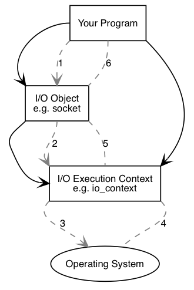
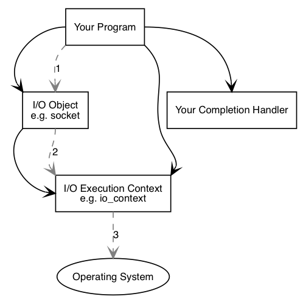
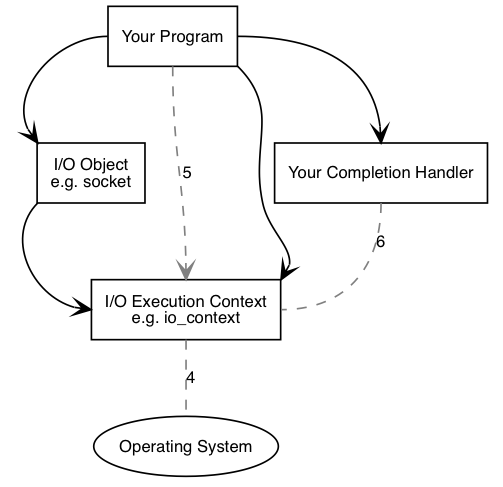

# Boost.Asio Anatomy

* Boost.Asio는 소켓과 같은 I/O 개체에서 동기 및 비동기 작업을 수행하는데 사용 가능함
* 아래의 그림은 Boost.Asio의 프로그램이 동작하는 방식에 대한 개념적 그림을 나타냄

<br/>

## Synchronous operations

<br/>



<br/>

* 프로그램 내부에는 최소 하나의 I/O execution context가 필요함
    * boost::asio::io_context, boost::asio::thread_pool, boost::asio::system_context.
* I/O execution context는 프로그램과 운영체제의 I/O 서비스와의 연결을 나타냄
```c++
boost::asio::io_context io_context;
```

* I/O operation을 수행하기 위해 TCP 소켓과 같은 II/O 오브젝트가 필요함

```c++
boost::asio::ip::tcp::socket socket(io_context);
```
* Synchronous 연결 동작 순서는 아래와 같이 진행됨

1. I/O 오브젝트를 호출함으로써 연결 동작을 초기화함

```c++
socket.connect(server_endpoint);
```

2. I/O 오브젝트는 요청을 I/O execution context로 전달함

3. I/O execution context는 연결 작업을 수행하기 위해 운영체제를 호출함

4. 운영체제는 결과를 I/O execution context에 전달함

5. I/O execution context는 실행간 발생하는 오류에 대해 boost::system::error_code 오브젝트로 리턴함
    * `error_code`를 특정 값과 비교하거나 boolean 형태로 나타낼 수 있음
    * 그 결과는 I/O 오브젝트로 다시 전달됨

6. 만약 동작 간에 fail될 경우, boost::system::system_error에 대한 예외를 I/O 오브젝트에 전달함

* 만약 아래의 코드와 같이 초기화를 진행할 경우, error_code 변수 ec가 결과로 설정되고 예외가 발생하지 않음

```c++
boost::system::error_code ec;
socket.connect(server_endpoint, ec);
```

<br/>

## Asynchronous operations

* Asynchronous operation은 다른 시퀀스로 이벤트가 발생함

<br/>



<br/>

1. I/O 오브젝트를 호출함으로써 연결 동작을 초기화함

```C++
socket.async_connect(server_endpoint, your_completion_handler);
```

* your_comletion_handler는 함수 혹은 signature가 있는 함수 오브젝트임

```C++
void your_completion_handler(const boost::system::error_code& ec);
```
* 필요한 signature는 수행 중인 비동기 작업에 따라 다름

<br/>

2. I/O 오브젝트는 요청을 I/O execution context에 전달함

3. I/O execution context는 비동기 연결을 시작해야 한다는 신호를 운영체제에 보냄

<br/>



<br/>

4. 운영체제는 I/O execution context에 결과를 큐에 담고, 연결작업이 완료되었음을 나타냄

5. I/O execution context로 io_context를 사용할 때, 프로그램은 `io_context::run()`(혹은 유사한 io_context의 멤버함수)를 호출함으로써 수행 결과를 검색
    * 완료되지 않은 비동기 작업이 있는 동안 block을 수행하는 함수이므로 일반적으로 비동기작업일 수행하자마자 호출

6. io_context::run() 호출 내부에서 I/O execution context는 작업 결과를 큐에서 빼고 error_code로 반환한 다음 이를 your_compliertion_handler에 전달함