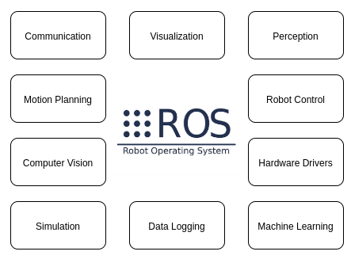

# Introduction

  ROS는 로봇 제어 소프트웨어 개발을 위해 개발된 오픈 소스 알고리즘, 하드웨어 드라이버 소프트웨어 및 Tool 세트이다. 이름에 Operating System으로 되어 있지만 실제 운영체제는 아니다.

 

* 통신 시스템(Publish/Subscribe, Remote Method Invocation)
* Frameworks, Tools(빌드시스템 및 의존성 관리, 가시화, Record 및 Replay기능)
* 생태계(Language bindings, 드라이버, 라이브러리 및 시뮬레이션(gazebo))

 

 초기 ROS는 대부분 학계 프로젝트를 위해 사용되었지만, ROS2는 실제 상용 프로젝트에서 사용될 수 있도록 개발되었다.

 ROS2의 가장 큰 변화는 통신 레이어에서 DDS 미들웨어를 사용했다는 점이다.

 DDS 미들웨어는 여러 국방 산업 프로젝트에서 검증되었으며, 각각 분산된 로봇 컴퍼넌트 간 분산 publish/subscribe 통신을 강화했다.

 ROS2는 오픈소스이며, 동시에 ROS2는 다중 로봇 통신, 실시간 통신 및 다양한 플랫폼 지원으로 다양한 분야에서 활용됨

 실제 ROS는 휴머노이드 로봇부터 산업용 로봇, 자율주행까지 다양한 분야에서 활용되고 있다.

  

 ROS는 항법, 제어, 모션 플래닝, 비젼, 시뮬레이션 목적으로 다양한 오픈소스 라이브러리를 제공한다.

 3D 가시화 툴인 RVIS는 ROS에서 상당히 중요한 툴로 사용되며, Gazebo 역시, 로봇 개발자들에게 유용하게 사용된다.

 Open CV 라이브러리는 ROS2에서 영상처리 용도로 사용되며, QT 그래픽 라이브러리 또한 ROS2 프로젝트에서 사용자 인터페이스 용도로 사용된다.

 

 

 다음 챕터부터 ROS2를 어떻게 셋업하고 어떻게 코드를 발전시킬지에 대해 작성한다.

## Reference
[Robot Operating System 2](http://asq.kr/XH2GZkvG)